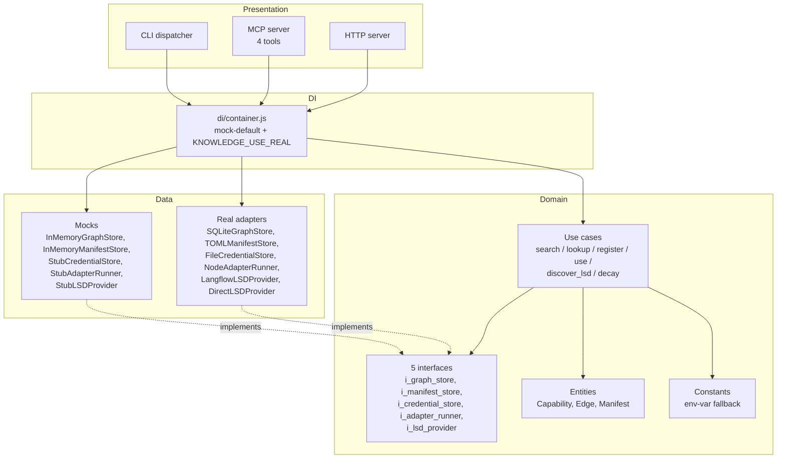
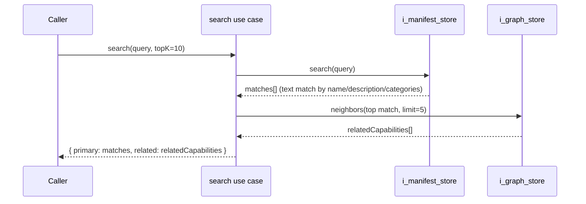
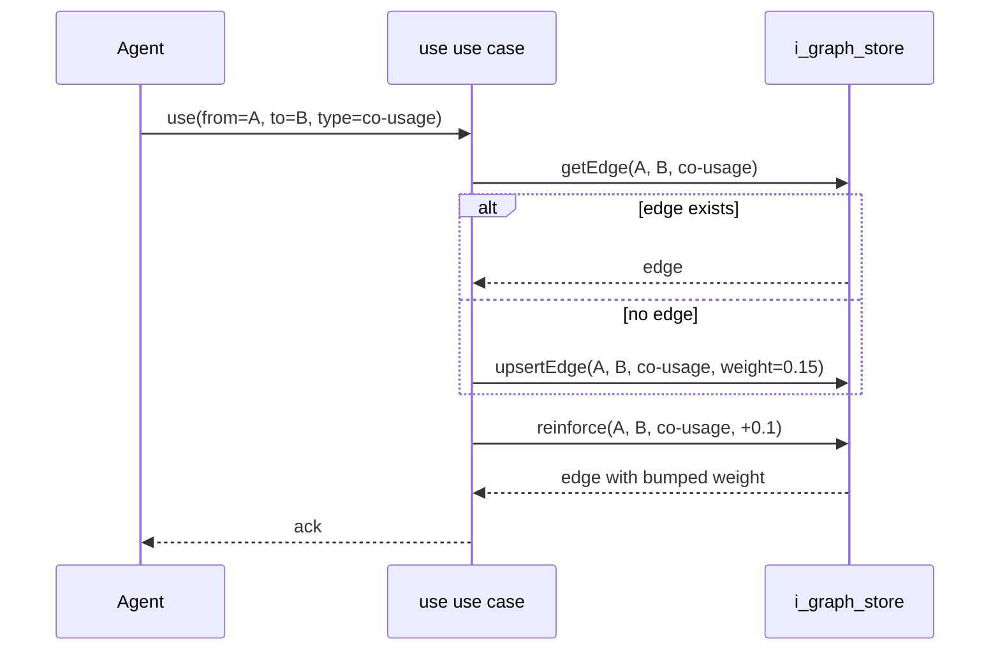
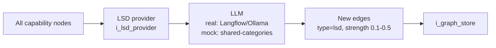
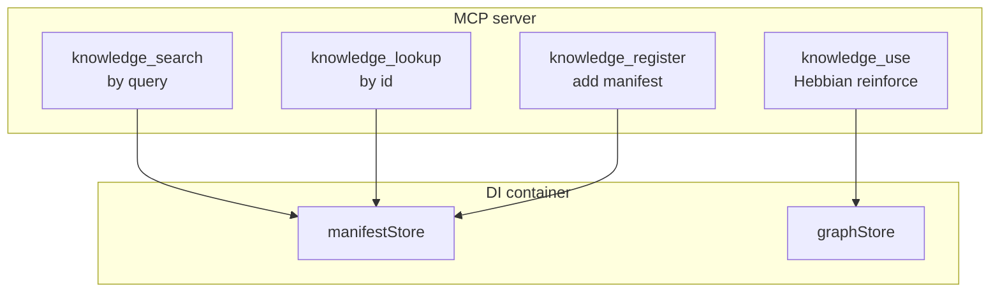

# ARCHITECTURE.md

How ai-knowledge is structured, where capability lookups + Hebbian strengthening + LSD discovery flow.

For the why, start with [README.md](README.md).

---

## 1. Clean architecture layering



---

## 2. Capability lookup flow



The graph augments the search: text-matching the manifest store gives the obvious hits, but the Hebbian-strengthened graph surfaces capabilities that *go with* the obvious ones. Over time the graph carries the bulk of the search quality.

---

## 3. Hebbian strengthening



**The rule:** every time the agent uses A and B together, the A↔B edge gets +`HEBBIAN_REINFORCE_RATE` (default 0.1, capped at 1.0). Edges that go a long time without use decay toward `DECAY_FLOOR` (default 0.01). Result: the graph self-organizes around actual usage patterns.

The decay job runs separately — usually nightly via cron. Not strictly required for the system to work; without it weights only ever go up.

---

## 4. LSD (Latent Semantic Discovery)



The LLM looks at the full set of capabilities and proposes edges between nodes that aren't yet linked but probably should be — based on what the descriptions suggest semantically.

Real path: a Langflow flow (or direct Ollama call) sends batches of nodes to a model and asks "given these capabilities, which pairs should be linked." Returns suggested edges with a strength score 0.1-0.5.

Mock path: deterministic stub. Pairs nodes that share at least one category, weights by overlap count. Reproducible, zero LLM calls — useful for tests and for showing the system working without an Ollama install.

---

## 5. Mock vs real swap

```mermaid
flowchart LR
    Env[KNOWLEDGE_USE_REAL env var<br/>"" / "graph,manifests" / "all"]
    Container[createContainer]
    Decide{For each integration<br/>in KNOWN_KEYS:<br/>is it in useReal?}
    Real[Real adapter<br/>SQLite, Langflow, file system]
    Mock[Stub<br/>Map-backed, deterministic]
    Bundle[Container bundle<br/>{graphStore, manifestStore,<br/>credentialStore, adapterRunner,<br/>lsdProvider}]

    Env --> Container
    Container --> Decide
    Decide -- "yes" --> Real
    Decide -- "no (default)" --> Mock
    Real --> Bundle
    Mock --> Bundle
```

Five swap keys: `graph`, `manifests`, `credentials`, `adapters`, `lsd`. Default → all five mocked. raj-sadan in production runs `KNOWLEDGE_USE_REAL=all`.

---

## 6. MCP tool surface



Four tools. Each one wraps a container method. Add a tool: register it in `src/presentation/mcp/server.js`.

---

## What's deliberately not here

- **Vector similarity search.** v0.1.0 does text matching on manifests. Adding an embedder + vector index (could share `ai-memory`'s) is a v0.2 follow-up.
- **Cross-organ orchestration.** ai-knowledge tells the agent *what* tools exist and how often pairs go together. It doesn't decide *whether* to invoke them — that's the cognitive layer.
- **Trust scoring.** A capability with weight 0.9 is "frequently used together" — not "high quality" or "secure." Quality and security live elsewhere (immunity, ministry-review).

---

## See also

- [README.md](README.md)
- [CHANGELOG.md](CHANGELOG.md)
- [`src/di/container.js`](src/di/container.js)
- [`src/presentation/mcp/server.js`](src/presentation/mcp/server.js)
